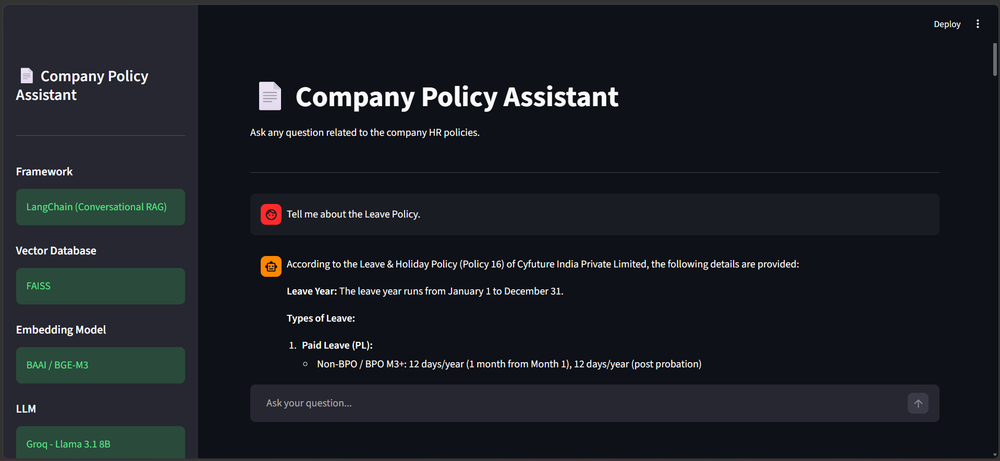

# Company Policy RAG Chatbot(LangChain)

A Conversational Retrieval-Augmented Generation (RAG) chatbot built using **LangChain**, **FAISS**, **Hugging Face Embeddings**, **Groq LLM**, and **Streamlit**. The chatbot allows users to ask questions about company HR policies and receives accurate, context-aware responses based on the uploaded policy document.



## 🖥️ Live Demo

[Open App](https://company-policy-chatbot-rag-langchain-hgotpiuthhwsqwainvbjlf.streamlit.app/)

## Features

- Conversational RAG with chat history
- PDF document processing and vector database creation
- FAISS vector store for semantic search
- BAAI BGE-M3 embedding model
- Groq Llama 3.1 8B for response generation
- Displays retrieved context and source page numbers
- Response time measurement for each query
- Streamlit-based user interface

## Tech Stack

- Python
- LangChain
- FAISS
- Hugging Face Embeddings (BAAI/bge-m3)
- Groq (Llama 3.1 8B Instant)
- Streamlit

## Project Structure

```
CompanyPolicyRAG_LangChain/
│
├── data/
│   └── Company_Policy.pdf
│
├── vector_store/
│   ├── index.faiss
│   └── index.pkl
│
├── app.py
├── rag.py
├── create_vector_db.py
├── requirements.txt
└── README.md
```

## How It Works

1. Load the company policy PDF.
2. Split the document into text chunks.
3. Generate embeddings using the BGE-M3 model.
4. Store embeddings in a FAISS vector database.
5. Retrieve the most relevant chunks for a user's query.
6. Use Groq's Llama 3.1 model to generate answers based on the retrieved context.
7. Display the answer, source pages, retrieved context, and response time.

## Future Improvements

- Streaming responses
- Multi-document support
- User authentication
- Document upload through the UI
- Deployment on Streamlit Cloud
